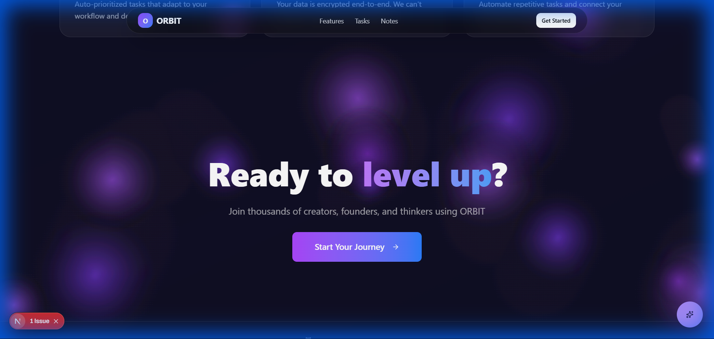
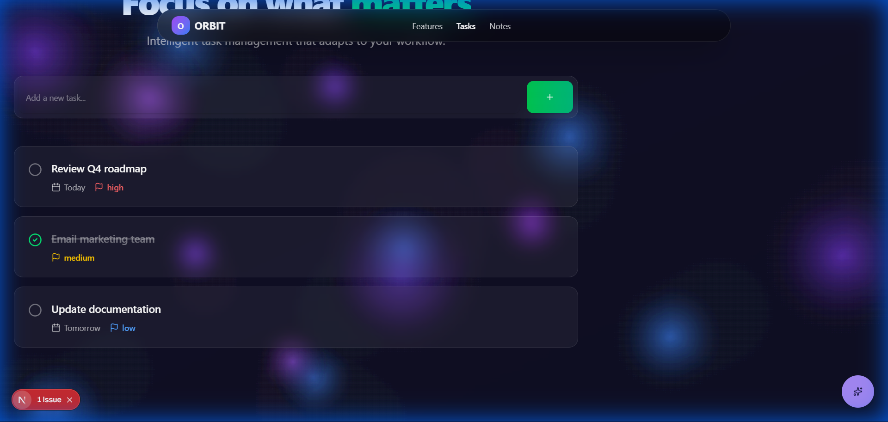
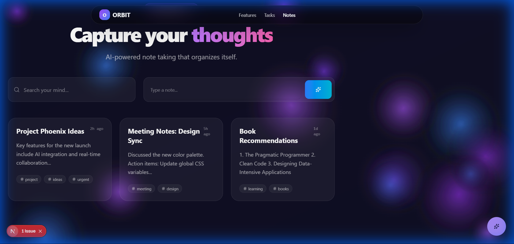

# ORBIT

ORBIT is a production-grade AI-powered personal productivity and knowledge system.

## Features
- **Smart Tasks**: Manage tasks with priority, deadlines, and tags.
- **Smart Notes**: Rich text notes with AI-powered auto-tagging and semantic search.
- **AI Queries**: Ask questions about your notes and extract insights.
- **Activity Timeline**: Track your productivity journey.

## Gallery

### Landing Page


### Smart Tasks


### Neural Notes


## Architecture
- **Frontend**: Next.js 14, Tailwind CSS, TypeScript.
- **Backend**: AWS Lambda, API Gateway, DynamoDB, Cognito.
- **Infrastructure**: Terraform.

## Getting Started

### Prerequisites
- Node.js 20+
- Terraform
- AWS CLI configured

### Setup
1. Install dependencies:
   ```bash
   cd frontend
   npm install
   ```
2. Deploy infrastructure:
   ```bash
   cd infrastructure
   terraform init
   terraform apply
   ```
